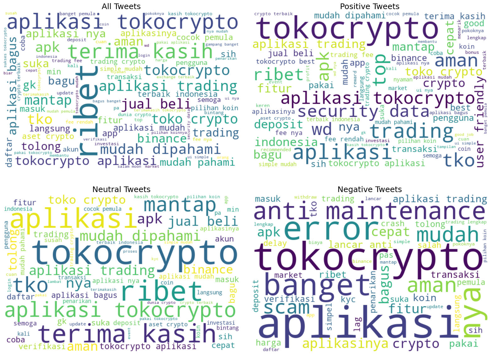

# Sentiment Analysis Toko Crypto on Google Play Store

### Deskripsi Proyek 
project ini digunakan untuk menganalisa sentiment dari aplikasi dana di google play store.
### Dataset
dataset dari project ini diambil dengan menggunakan google_play_scrapper dengan jumlah data 1000. dengan feature reviewId,userName, userImage, content                   
score, thumbsUpCount, reviewCreatedVersion, at, replyContent, repliedAt         
dan appVersion    

## 📚 Teknologi yang Digunakan
- Tensorflow 
- Nltk
- WordCloud
- Matplotlib


## 🔄 Arsitektur model


Model 1
| Layer (type)                          | Output Shape                  | Param #                               |
|---------------------------------------|-------------------------------|---------------------------------------|
| dense (Dense)                         | (None, 128)                   | X_train.shape[1] * 128 + 128          |
| dropout (Dropout)                     | (None, 128)                   | 0                                     |
| batch_normalization (BatchNormalization) | (None, 128)                | 512                                   |
| dense_1 (Dense)                       | (None, 64)                    | 128 * 64 + 64                         |
| dropout_1 (Dropout)                   | (None, 64)                    | 0                                     |
| dense_2 (Dense)                       | (None, y_one_hot.shape[1])    | 64 * y_one_hot.shape[1] + y_one_hot.shape[1] |


### Rangkuman Skema Model

- **Model 1**  
  Data dibagi dengan rasio **80/20**, dilakukan ekstraksi fitur menggunakan **TF-IDF**, dan menggunakan **callback early stopping**.

- **Model 2**  
  Data dibagi dengan rasio **70/30**, dilakukan ekstraksi fitur menggunakan **TF-IDF**, serta menerapkan **callback early stopping**.

- **Model 3**  
  Data dibagi dengan rasio **80/20**, fitur diekstraksi menggunakan **Word2Vec**, dan menggunakan **learning rate callback**.

## WordCloud All Sentiment


## 📊 Grafik Akurasi Train dan Test
| Model | Skema    | Accuracy Train | Accuracy Test |
|-------|----------|----------------|---------------|
| 0     | Skema 1  | 0.925717       | 0.922258      |
| 1     | Skema 2  | 0.904879       | 0.905492      |
| 2     | Skema 3  | 0.912257       | 0.868117      |


## 🧑‍💻 Cara Pengunaan
1. Clone repositori:
   ```bash
   git clone https://github.com/username/repo-name.git
    cd repo-name
2. Install Package :
   ```bash
   pip install -r requirements.txt

## 🧪 Cara inference 
1. Jalankan notebook.ipynb
2. Jalankan infrence_test.ipynb
3. inputkan sentiment negatif/positif/netral
   
   

